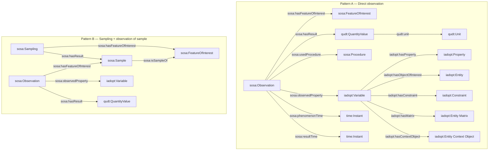

# Equivalency tables: SSN/SOSA, O&M, OBOE, I-ADOPT

I-ADOPT is a lightweight ontological framework for representing observable properties (variables) in a
decomposed, machine-interpretable form. It defines four core classes – Variable, Property, Entity, and
Constraint – connected by a set of relations . At minimum, a Variable consists of one Entity (the thing or
process being observed, termed the Object of Interest) and one Property (the characteristic or quantity
being measured) . Additional Entities can be linked in roles such as Matrix (an entity that contains or is
the medium for the object of interest) or Context Object (an entity providing broader context) .
Constraints can be attached to limit the scope or state of any component (e.g. specifying a particular
condition or subset, like “juvenile” for a life stage) . Notably, I-ADOPT itself does not encode certain
metadata such as units, instruments, time, location, or methods – instead it is designed to connect to other
ontologies for those details . This separation keeps I-ADOPT focused on the semantic content of what is
observed, while encouraging reuse of complementary vocabularies for how/when/where aspects.

## Sources (authoritative)

- SSN/SOSA 2023 Edition spec (definitions + alignments): https://www.w3.org/TR/vocab-ssn-2023/
- W3C-maintained SSN ↔ O&M mapping table (handy crosswalk): https://www.w3.org/2015/spatial/wiki/Mapping_Table
- OGC/ISO Observations & Measurements (O&M) model (OGC 10-004r3 / ISO 19156): https://portal.ogc.org/files/?artifact_id=41579
- OBOE ontology file (core OWL): https://semtools.ecoinformatics.org/releases/oboe/1.1/oboe-core.owl
- I-ADOPT framework ontology docs (v1.0.3 archive with stable anchors): https://i-adopt.github.io/ontology/archive/1.0.3/index.html
- Darwin Core terms (classes + predicates): https://rs.tdwg.org/dwc/terms/

## How the pieces fit

The most defensible pattern in practice is:

* Use SOSA/O&M/OBOE to model the observation event + result, and
* Use I-ADOPT to model the meaning of the observed variable (then point the observation’s “observed property” at the I-ADOPT Variable URI).

---

## Table 1 — Clean equivalency table (concepts)

DwC-CM (Darwin Core Conceptual Model) describes how Darwin Core record types relate (events, occurrences, organisms, measurements).

| Concept / role | SSN / SOSA (W3C/OGC) | O&M / OMS (ISO 19156) | OBOE | I-ADOPT | DwC-CM (Darwin Core) |
|---|---|---|---|---|---|
| Observation / act (an event that produces a result) | [sosa:Observation](https://www.w3.org/TR/vocab-ssn-2023/#SOSAObservation) | [OM_Observation](https://portal.ogc.org/files/?artifact_id=41579#page=16) | [oboe:Observation](https://semtools.ecoinformatics.org/releases/oboe/1.1/oboe-core.owl#Observation) | N/A ([I-ADOPT scope](https://i-adopt.github.io/ontology/archive/1.0.3/index.html)) | [dwc:Event](https://rs.tdwg.org/dwc/terms/Event) (e.g., [dwc:eventDate](https://rs.tdwg.org/dwc/terms/eventDate), [dwc:samplingProtocol](https://rs.tdwg.org/dwc/terms/samplingProtocol), [dwc:recordedBy](https://rs.tdwg.org/dwc/terms/recordedBy)) |
| What the observation is about (instance-level) | [sosa:FeatureOfInterest](https://www.w3.org/TR/vocab-ssn-2023/#SOSAFeatureOfInterest) | `featureOfInterest` role played by a [GFI_Feature](https://portal.ogc.org/files/?artifact_id=41579#page=16) | [oboe:Entity](https://semtools.ecoinformatics.org/releases/oboe/1.1/oboe-core.owl#Entity) | [iadopt:Entity](https://i-adopt.github.io/ontology/archive/1.0.3/index.html#Entity) | [dwc:Occurrence](https://rs.tdwg.org/dwc/terms/Occurrence) (state of [dwc:Organism](https://rs.tdwg.org/dwc/terms/Organism) in a [dwc:Event](https://rs.tdwg.org/dwc/terms/Event); links: [dwc:organismID](https://rs.tdwg.org/dwc/terms/organismID), [dwc:eventID](https://rs.tdwg.org/dwc/terms/eventID)) |
| Observed property (what’s being observed, at observation-time) | [sosa:observedProperty](https://www.w3.org/TR/vocab-ssn-2023/#SOSAobservedProperty) → [sosa:Property](https://www.w3.org/TR/vocab-ssn-2023/#SOSAProperty) | `observedProperty` role played by a [GF_PropertyType](https://portal.ogc.org/files/?artifact_id=41579#page=17) | [oboe:Characteristic](https://semtools.ecoinformatics.org/releases/oboe/1.1/oboe-core.owl#Characteristic) | Typically: [iadopt:Variable](https://i-adopt.github.io/ontology/archive/1.0.3/index.html#Variable) (used as the value of `observedProperty`) | [dwc:MeasurementOrFact](https://rs.tdwg.org/dwc/terms/MeasurementOrFact) (or DwC-CM draft `dwc:Assertion`) with [dwc:measurementType](https://rs.tdwg.org/dwc/terms/measurementType) |
| Variable / observable property definition (decomposable meaning) | No native decomposition primitive (pattern-level) — see [SSN patterns](https://www.w3.org/TR/vocab-ssn-2023/) | No native decomposition primitive (pattern-level) — see [O&M discussion of observedProperty](https://portal.ogc.org/files/?artifact_id=41579#page=17) | No native decomposition primitive (core focuses on Observation/Measurement) — see [OBOE file](https://semtools.ecoinformatics.org/releases/oboe/1.1/oboe-core.owl) | [iadopt:Variable](https://i-adopt.github.io/ontology/archive/1.0.3/index.html#Variable) + ([iadopt:hasProperty](https://i-adopt.github.io/ontology/archive/1.0.3/index.html#hasProperty), [iadopt:hasObjectOfInterest](https://i-adopt.github.io/ontology/archive/1.0.3/index.html#hasObjectOfInterest), …) | No native decomposition primitive; use [dwc:measurementType](https://rs.tdwg.org/dwc/terms/measurementType) as a vocabulary/URI pointer to a variable definition (e.g., an I-ADOPT Variable URI) |
| Property component (atomic characteristic inside a variable definition) | [sosa:Property](https://www.w3.org/TR/vocab-ssn-2023/#SOSAProperty) | [GF_PropertyType](https://portal.ogc.org/files/?artifact_id=41579#page=17) | [oboe:Characteristic](https://semtools.ecoinformatics.org/releases/oboe/1.1/oboe-core.owl#Characteristic) | [iadopt:Property](https://i-adopt.github.io/ontology/archive/1.0.3/index.html#Property) | [dwc:measurementType](https://rs.tdwg.org/dwc/terms/measurementType) (URI preferred) |
| Object of interest component (entity role in variable definition) | Typically implicit via FOI typing (see [sosa:hasFeatureOfInterest](https://www.w3.org/TR/vocab-ssn-2023/#SOSAhasFeatureOfInterest)) | [GFI_Feature](https://portal.ogc.org/files/?artifact_id=41579#page=16) as FOI | [oboe:Entity](https://semtools.ecoinformatics.org/releases/oboe/1.1/oboe-core.owl#Entity) | [iadopt:hasObjectOfInterest](https://i-adopt.github.io/ontology/archive/1.0.3/index.html#hasObjectOfInterest) → [iadopt:Entity](https://i-adopt.github.io/ontology/archive/1.0.3/index.html#Entity) | Not decomposed; target entity via IDs such as [dwc:occurrenceID](https://rs.tdwg.org/dwc/terms/occurrenceID), [dwc:organismID](https://rs.tdwg.org/dwc/terms/organismID), [dwc:materialEntityID](https://rs.tdwg.org/dwc/terms/materialEntityID) (and [dwc:eventID](https://rs.tdwg.org/dwc/terms/eventID) for event-scoped assertions) |
| Context object / covariate entity | Not first-class in SOSA core (pattern-level) — see [SSN patterns](https://www.w3.org/TR/vocab-ssn-2023/) | Often via parameters / application schema (see [NamedValue](https://portal.ogc.org/files/?artifact_id=41579#page=20)) | Often via contextual observations (see [OM_ObservationContext analogue](https://portal.ogc.org/files/?artifact_id=41579#page=19)) | [iadopt:hasContextObject](https://i-adopt.github.io/ontology/archive/1.0.3/index.html#hasContextObject) | Additional [dwc:MeasurementOrFact](https://rs.tdwg.org/dwc/terms/MeasurementOrFact) rows sharing the same [dwc:eventID](https://rs.tdwg.org/dwc/terms/eventID)/[dwc:occurrenceID](https://rs.tdwg.org/dwc/terms/occurrenceID) (or DwC-CM draft `dwc:Assertion`) |
| Matrix (carrier medium) | Not first-class in SOSA core (pattern-level) — see [SSN patterns](https://www.w3.org/TR/vocab-ssn-2023/) | Not first-class in O&M core (often modelled in application schema / parameters) — see [NamedValue](https://portal.ogc.org/files/?artifact_id=41579#page=20) | Pattern-level / context modelling — see [OBOE file](https://semtools.ecoinformatics.org/releases/oboe/1.1/oboe-core.owl) | [iadopt:hasMatrix](https://i-adopt.github.io/ontology/archive/1.0.3/index.html#hasMatrix) | [dwc:MaterialEntity](https://rs.tdwg.org/dwc/terms/MaterialEntity) / [dwc:MaterialSample](https://rs.tdwg.org/dwc/terms/MaterialSample) via [dwc:materialEntityID](https://rs.tdwg.org/dwc/terms/materialEntityID) / [dwc:materialSampleID](https://rs.tdwg.org/dwc/terms/materialSampleID) |
| Constraint / qualifier on meaning | Pattern-level (not core) — see [SSN patterns](https://www.w3.org/TR/vocab-ssn-2023/) | Pattern-level (profiles / app schema constraints) — see [O&M consistency discussion](https://portal.ogc.org/files/?artifact_id=41579#page=18) | Pattern-level (often annotations / context patterns) — see [OBOE file](https://semtools.ecoinformatics.org/releases/oboe/1.1/oboe-core.owl) | [iadopt:Constraint](https://i-adopt.github.io/ontology/archive/1.0.3/index.html#Constraint) + [iadopt:hasConstraint](https://i-adopt.github.io/ontology/archive/1.0.3/index.html#hasConstraint) + [iadopt:constrains](https://i-adopt.github.io/ontology/archive/1.0.3/index.html#constrains) | Record/organism qualifiers (e.g., [dwc:lifeStage](https://rs.tdwg.org/dwc/terms/lifeStage), [dwc:sex](https://rs.tdwg.org/dwc/terms/sex)); measurement qualifiers (e.g., [dwc:measurementMethod](https://rs.tdwg.org/dwc/terms/measurementMethod), [dwc:measurementAccuracy](https://rs.tdwg.org/dwc/terms/measurementAccuracy), [dwc:measurementRemarks](https://rs.tdwg.org/dwc/terms/measurementRemarks)) |
| Procedure / method used | [sosa:Procedure](https://www.w3.org/TR/vocab-ssn-2023/#SOSAProcedure) (linked from Observation via [sosa:usedProcedure](https://www.w3.org/TR/vocab-ssn-2023/#SOSAusedProcedure)) | [OM_Process](https://portal.ogc.org/files/?artifact_id=41579#page=19) via `ProcessUsed` ([association](https://portal.ogc.org/files/?artifact_id=41579#page=17)) | [oboe:Protocol](https://semtools.ecoinformatics.org/releases/oboe/1.1/oboe-core.owl#Protocol) | N/A in core ([I-ADOPT scope note: “does not capture … methods”](https://i-adopt.github.io/ontology/archive/1.0.3/index.html)) | [dwc:samplingProtocol](https://rs.tdwg.org/dwc/terms/samplingProtocol) (Event), [dwc:measurementMethod](https://rs.tdwg.org/dwc/terms/measurementMethod) (MeasurementOrFact/Assertion) |
| Result (object) / value | [sosa:hasResult](https://www.w3.org/TR/vocab-ssn-2023/#SOSAhasResult) / [sosa:hasSimpleResult](https://www.w3.org/TR/vocab-ssn-2023/#SOSAhasSimpleResult) | `result` (Range association) ([discussion](https://portal.ogc.org/files/?artifact_id=41579#page=17)) | [oboe:Measurement](https://semtools.ecoinformatics.org/releases/oboe/1.1/oboe-core.owl#Measurement) | N/A ([I-ADOPT scope](https://i-adopt.github.io/ontology/archive/1.0.3/index.html)) | [dwc:measurementValue](https://rs.tdwg.org/dwc/terms/measurementValue) (and often [dwc:occurrenceStatus](https://rs.tdwg.org/dwc/terms/occurrenceStatus) for presence/absence) |
| Units / measurement standard | External to SOSA (attach to result via QUDT/OM/UCUM) — see [SSN guidance](https://www.w3.org/TR/vocab-ssn-2023/) | Units are part of result typing / measure types (profile-dependent) — see [O&M measurement examples](https://portal.ogc.org/files/?artifact_id=41579#page=22) | [oboe:Standard](https://semtools.ecoinformatics.org/releases/oboe/1.1/oboe-core.owl#Standard) | N/A in core ([I-ADOPT scope note: “does not capture … units”](https://i-adopt.github.io/ontology/archive/1.0.3/index.html)) | [dwc:measurementUnit](https://rs.tdwg.org/dwc/terms/measurementUnit) |
| Sampling act / sample | [sosa:Sampling](https://www.w3.org/TR/vocab-ssn-2023/#SOSASampling); [sosa:Sample](https://www.w3.org/TR/vocab-ssn-2023/#SOSASample) | Sampling Features integrated with O&M/OMS ([see O&M spec context](https://portal.ogc.org/files/?artifact_id=41579)) | Sample as [oboe:Entity](https://semtools.ecoinformatics.org/releases/oboe/1.1/oboe-core.owl#Entity) + protocols (pattern-level) | N/A ([I-ADOPT scope](https://i-adopt.github.io/ontology/archive/1.0.3/index.html)) | [dwc:Event](https://rs.tdwg.org/dwc/terms/Event) + [dwc:MaterialSample](https://rs.tdwg.org/dwc/terms/MaterialSample)/[dwc:MaterialEntity](https://rs.tdwg.org/dwc/terms/MaterialEntity); hierarchies via [dwc:parentEventID](https://rs.tdwg.org/dwc/terms/parentEventID) |

## Table 2 — Minimal alignment meta-model (SOSA + I-ADOPT)

An alignment meta-model is a small template showing the minimum classes and predicates you need so different ontologies can describe observations in the same shared pattern. Upper-level alignment means you align at that shared pattern first, then add domain details as needed.

| Concern | Minimum (prefer SOSA + I-ADOPT) | Common gap-fillers (O&M / OBOE) |
|---|---|---|
| Observation event + linking | `sosa:Observation` `sosa:hasFeatureOfInterest` → `sosa:FeatureOfInterest` (or `sosa:Sample`) `sosa:observedProperty` → `iadopt:Variable` | OBOE’s `oboe:Observation` + `oboe:Measurement` can be a better fit when you want one event with many per-value measurement nodes. |
| Variable meaning (decomposable) | `iadopt:Variable` `iadopt:hasProperty` → `iadopt:Property` `iadopt:hasObjectOfInterest` → `iadopt:Entity` (optional) `iadopt:hasConstraint` → `iadopt:Constraint` (+ `iadopt:constrains` to say what it qualifies) (optional) `iadopt:hasMatrix` / `iadopt:hasContextObject` → `iadopt:Entity` | SOSA, O&M, and OBOE do not natively decompose variable meaning; I-ADOPT is the piece that fills this gap. |
| Result value | `sosa:hasSimpleResult` → literal, or `sosa:hasResult` → result node | OBOE makes the result a `oboe:Measurement` node, which is convenient when you need to attach metadata to the value. |
| Units | Attach units to the result node (I-ADOPT does not model units). | OBOE has `oboe:Standard` as a unit/standard hook; O&M typically handles units via typed results in a profile (a project-specific specialization of the base model). |
| Procedure / method | `sosa:usedProcedure` → `sosa:Procedure` (I-ADOPT is intentionally not the “how” layer). | O&M `NamedValue` (a name/value pair for method parameters) is handy for capturing procedure settings without minting many procedures. |
| Time | `sosa:phenomenonTime` and/or `sosa:resultTime` | O&M has similar time roles; use it if you’re already in ISO 19156 workflows. |
| Sampling + samples | `sosa:Sampling` with `sosa:hasResult` → `sosa:Sample`, and `sosa:isSampleOf` linking sample → source FOI | O&M/OMS sampling features are richer if you need explicit sampling-feature geometry or representativeness semantics. |
| Context / covariates | Model covariates as their own `sosa:Observation`s, or as I-ADOPT context entities via `iadopt:hasContextObject`/`iadopt:hasMatrix`. | O&M `NamedValue` or OBOE contextual-observation patterns can be simpler when you have many per-event parameters. |
| Result quality / uncertainty | Put quality/uncertainty on the result node (using whichever quality vocabulary you pick). | O&M `resultQuality` (a slot for quality metadata about the result) is explicit; OBOE’s per-measurement node makes per-value quality flags straightforward. |
| Bundles (rows with multiple measures) | `sosa:ObservationCollection` (a grouping of observations) or a dataset-specific grouping resource | OBOE’s Observation→Measurement structure often matches table-shaped data without extra collection resources. |

## Diagram — How the pieces fit (Mermaid)

Notes:

- OWL-Time (a W3C vocabulary for representing times) is used here via `time:Instant`; you can also use intervals where needed.
- QUDT (a unit vocabulary) is used here for units; UCUM (Unified Code for Units of Measure, a standard unit code list) is an alternative.

## Practical pattern to use for Salmon Ontology Modelling 

1. Model the observation event + result in SOSA/SSN (or O&M / OBOE).

* This is your row-level (or cell-level) data reality: an Observation happened, it has a Feature of Interest, an observed property, a result value, a time, maybe a sensor/procedure.

2. Model the meaning of the observed variable in I-ADOPT.

* This is your reusable semantic “variable definition” object: it decomposes the variable into Property + Entity roles + Constraints (+ StatisticalModifier if needed).

3. Link them:

* Set sosa:observedProperty (or O&M observedProperty) to the I-ADOPT Variable IRI.

* Your data values remain in the Observation/Measurement layer (SOSA or OBOE), with units attached via QUDT/OM/UCUM.

## Key “don’t accidentally do this” rules

Don’t put units inside I-ADOPT (attach units to results via QUDT/OM/UCUM).

Don’t put methods/procedures inside I-ADOPT (attach methods to observations via sosa:usedProcedure / O&M process / OBOE protocol).
