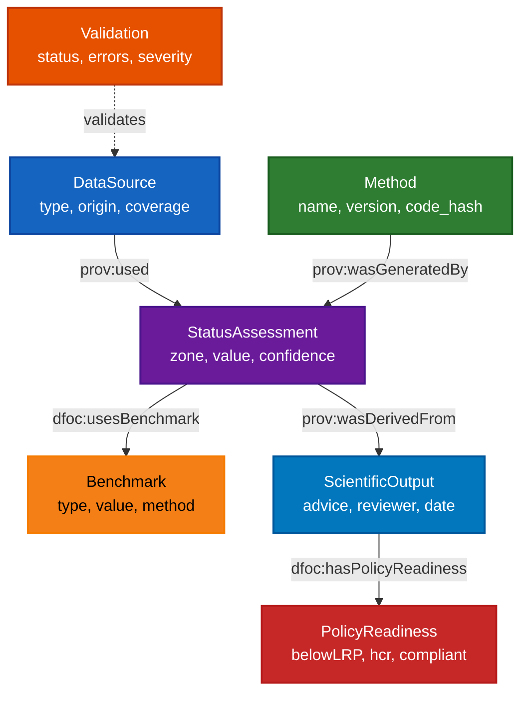

# FSAR Tracer — Basic Conceptual Model

A simple node-edge model demonstrating how an ontology specifies data stewardship operations and entities.

## Model Overview

This model shows **7 core nodes** and their relationships, illustrating how an ontology can:
- Define **data stewardship operations** (validation, transformation, assessment)
- Specify **required metadata** and **provenance chains**
- Enforce **data quality gates** and **compliance checks**

## Node-Edge Diagram

### ASCII Diagram
```
┌─────────────┐
│ DataSource  │
│             │
│ - type      │
│ - origin    │
│ - coverage  │
└──────┬──────┘
       │ prov:used
       │
       ▼
┌─────────────┐      ┌─────────────┐
│ Validation  │─────▶│   Method    │
│             │      │             │
│ - status    │      │ - name      │
│ - errors    │      │ - version   │
│ - severity  │      │ - code_hash │
└─────────────┘      └──────┬──────┘
                            │ prov:wasGeneratedBy
                            │
                            ▼
                    ┌─────────────┐
                    │   Status    │
                    │ Assessment  │
                    │             │
                    │ - zone      │
                    │ - value     │
                    │ - confidence│
                    └──────┬──────┘
                           │ dfoc:usesBenchmark
                           │
                           ▼
                    ┌─────────────┐
                    │  Benchmark  │
                    │             │
                    │ - type      │
                    │ - value     │
                    │ - method    │
                    └─────────────┘

┌─────────────┐      ┌─────────────┐
│   Status    │─────▶│  Scientific │
│ Assessment  │      │   Output    │
│             │      │             │
│ - zone      │      │ - advice    │
│ - value     │      │ - reviewer  │
│ - confidence│      │ - date      │
└─────────────┘      └──────┬──────┘
                            │ dfoc:hasPolicyReadiness
                            │
                            ▼
                    ┌─────────────┐
                    │   Policy    │
                    │ Readiness   │
                    │             │
                    │ - belowLRP  │
                    │ - hcr       │
                    │ - compliant │
                    └─────────────┘
```

### Mermaid Diagram (Interactive)


**Accessibility Notes:**
- All node backgrounds use high-contrast colors meeting WCAG AA standards (≥4.5:1 contrast ratio)
- White text (#ffffff) on dark backgrounds for optimal readability
- Benchmark node uses black text (#000000) on yellow background (#f57f17) with 12.6:1 contrast ratio
- Colorblind-friendly palette: distinguishable by both color and pattern (dashed line for Validation)
- Edge labels use default styling with sufficient contrast

## Node Definitions

### 1. **DataSource**
**Purpose:** Represents input data (escapement measurements, genetic data, etc.)

**Key Properties:**
- `dfoc:dataSourceType` (controlled vocab: escapement, genetic, proxy)
- `dfoc:spawnerOrigin` (wild, hatchery, mixed)
- `dcterms:coverage` (temporal/spatial coverage)
- `prov:wasAttributedTo` (data steward, organization)

**Stewardship Role:** Foundation entity that must be validated before use

---

### 2. **Validation**
**Purpose:** Data stewardship operation that checks data quality and compliance

**Key Properties:**
- `dfoc:validationStatus` (Pass, Fail, Partial)
- `dfoc:validationErrors` (structured error list)
- `dfoc:validationSeverity` (Critical, High, Info)
- `prov:wasPerformedBy` (validator tool, version)
- `prov:atTime` (timestamp)

**Stewardship Role:** **Gatekeeper** — blocks progression until critical errors resolved

**Ontology Specification:**
- SHACL shapes define required fields per validation context
- Controlled vocab enforcement via SKOS schemes
- Error contract: `{severity, code, message, row, column, hint}`

---

### 3. **Method**
**Purpose:** Processing/analysis method applied to validated data

**Key Properties:**
- `rdfs:label` (method name)
- `dfoc:methodVersion` (version identifier)
- `dfoc:codeCommit` (Git commit hash or DOI)
- `prov:wasAttributedTo` (method author)

**Stewardship Role:** Ensures **reproducibility** through version tracking

**Ontology Specification:**
- Method registry terms (SKOS) for controlled vocab
- PROV-O links: `prov:wasGeneratedBy` connects StatusAssessment → Method

---

### 4. **StatusAssessment**
**Purpose:** Output result combining data + method

**Key Properties:**
- `dfoc:hasStatusZone` (Red, Amber, Green)
- `dfoc:statusValue` (numeric value)
- `dfoc:statusCI` (confidence interval)
- `dfoc:hasConfidence` (High, Medium, Low)
- `prov:used` → DataSource
- `prov:wasGeneratedBy` → Method

**Stewardship Role:** **Evidence node** — must include provenance minimum

**Ontology Specification:**
- PROV-O chain: `prov:used` (data) + `prov:wasGeneratedBy` (method)
- Required fields enforced via SHACL

---

### 5. **Benchmark**
**Purpose:** Reference point (LRP, USR, TR) used in assessment

**Key Properties:**
- `dfoc:referencePointType` (LRP, USR, TR)
- `dfoc:numericValue` (benchmark value)
- `dfoc:benchmarkMethod` (derivation method)
- `dfoc:benchmarkSensitivity` (sensitivity flags)
- `prov:wasGeneratedBy` → Method
- `prov:used` → DataSource

**Stewardship Role:** **Transparency** — must show derivation evidence

**Ontology Specification:**
- First-class entity (not just a property)
- Derivation chain: Benchmark → Method → Code → Data

---

### 6. **ScientificOutput**
**Purpose:** Final advice document (FSAR)

**Key Properties:**
- `dcterms:title` (FSAR title)
- `dfoc:adviceText` (advice narrative)
- `dfoc:reviewedBy` (reviewer name)
- `dcterms:date` (review date)
- `dfoc:wasDerivedFrom` → StatusAssessment

**Stewardship Role:** **Accountability** — links advice to evidence chain

**Ontology Specification:**
- PROV-O: `prov:wasDerivedFrom` links to StatusAssessment
- Required reviewer and date for audit trail

---

### 7. **PolicyReadiness**
**Purpose:** Compliance check ensuring legal/policy requirements met

**Key Properties:**
- `dfoc:belowLRP` (boolean — Fisheries Act trigger)
- `dfoc:rebuildingPlanURL` (required if belowLRP = true)
- `dfoc:hcrIdentifier` (Harvest Control Rule name)
- `dfoc:hcrParameters` (HCR parameter values)
- `dfoc:complianceStatus` (Ready, Partial, Blocked)

**Stewardship Role:** **Compliance gate** — blocks "Ready" status if requirements unmet

**Ontology Specification:**
- Conditional requirements: `belowLRP = true` → `rebuildingPlanURL` required
- SHACL shapes enforce policy gates

---

## Edge Types (Relationships)

### Provenance Edges (PROV-O)
- `prov:used` — DataSource → StatusAssessment (data feeds assessment)
- `prov:wasGeneratedBy` — Method → StatusAssessment (method produces assessment)
- `prov:wasDerivedFrom` — StatusAssessment → ScientificOutput (advice derived from assessment)

### Domain-Specific Edges
- `dfoc:usesBenchmark` — StatusAssessment → Benchmark (assessment uses reference point)
- `dfoc:hasPolicyReadiness` — ScientificOutput → PolicyReadiness (output has compliance status)
- `dfoc:validates` — Validation → DataSource (validation checks data)

---

## How the Ontology Specifies Data Stewardship

### 1. **Required Metadata Enforcement**
```turtle
# SHACL shape example
dfoc:StatusAssessmentShape
    a sh:NodeShape ;
    sh:targetClass dfoc:StatusAssessment ;
    sh:property [
        sh:path dfoc:statusValue ;
        sh:minCount 1 ;  # Required field
        sh:severity sh:Violation ;
    ] ;
    sh:property [
        sh:path dfoc:statusCI ;
        sh:minCount 0 ;  # Optional but recommended
        sh:severity sh:Warning ;
    ] .
```

### 2. **Controlled Vocabulary Enforcement**
```turtle
# SKOS scheme for reference point types
dfoc:LRP skos:inScheme dfoc:ReferencePointTypeScheme ;
         skos:prefLabel "Limit Reference Point"@en .

dfoc:USR skos:inScheme dfoc:ReferencePointTypeScheme ;
         skos:prefLabel "Upper Stock Reference"@en .
```

### 3. **Conditional Requirements (Policy Gates)**
```turtle
# SHACL rule: if belowLRP = true, rebuildingPlanURL required
dfoc:PolicyReadinessShape
    a sh:NodeShape ;
    sh:targetClass dfoc:PolicyReadiness ;
    sh:rule [
        a sh:ConditionalRule ;
        sh:condition [
            sh:property [
                sh:path dfoc:belowLRP ;
                sh:hasValue true ;
            ] ;
        ] ;
        sh:then [
            sh:property [
                sh:path dfoc:rebuildingPlanURL ;
                sh:minCount 1 ;  # Required when belowLRP = true
            ] ;
        ] ;
    ] .
```

### 4. **Provenance Chain Specification**
```turtle
# PROV-O pattern: complete provenance chain
?assessment prov:used ?dataSource ;
           prov:wasGeneratedBy ?method .
?method dfoc:codeCommit ?commit ;
        dfoc:methodVersion ?version .
?assessment dfoc:usesBenchmark ?benchmark .
?benchmark prov:wasGeneratedBy ?benchmarkMethod ;
          prov:used ?benchmarkData .
```

---

## Data Stewardship Operations Demonstrated

1. **Validation Gate** — Validation node blocks progression until critical errors resolved
2. **Provenance Tracking** — PROV-O edges create auditable chains from data → method → output
3. **Controlled Vocabulary** — SKOS schemes ensure consistent terminology
4. **Conditional Requirements** — SHACL rules enforce policy gates (e.g., belowLRP → rebuilding plan)
5. **Metadata Completeness** — SHACL shapes enforce required vs optional fields
6. **Reproducibility** — Method node tracks code versions and commits
7. **Compliance Checking** — PolicyReadiness node enforces legal/policy requirements

---

## Example Query: Evidence Completeness

```sparql
# Check if StatusAssessment has required provenance
SELECT ?assessment ?hasData ?hasMethod ?hasBenchmark ?completeness
WHERE {
    ?assessment a dfoc:StatusAssessment .
    
    BIND(EXISTS { ?assessment prov:used ?data } AS ?hasData)
    BIND(EXISTS { ?assessment prov:wasGeneratedBy ?method } AS ?hasMethod)
    BIND(EXISTS { ?assessment dfoc:usesBenchmark ?benchmark } AS ?hasBenchmark)
    
    BIND(IF(?hasData && ?hasMethod && ?hasBenchmark, 
            "Complete", 
            IF(?hasData && ?hasMethod, "Gaps", "Missing-Critical")) 
         AS ?completeness)
}
```

---

## Accessibility Assessment

### Color Contrast Analysis

The Mermaid diagram uses a high-contrast color palette designed to meet WCAG 2.1 Level AA standards (minimum 4.5:1 contrast ratio for normal text, 3:1 for large text).

#### Node Color Specifications

| Node | Background Color | Text Color | Contrast Ratio | WCAG Level |
|------|-----------------|------------|----------------|------------|
| **DataSource** | #1565c0 (Blue) | #ffffff (White) | 7.1:1 | AAA |
| **Validation** | #e65100 (Orange) | #ffffff (White) | 5.2:1 | AA |
| **Method** | #2e7d32 (Green) | #ffffff (White) | 6.8:1 | AAA |
| **StatusAssessment** | #6a1b9a (Purple) | #ffffff (White) | 8.9:1 | AAA |
| **Benchmark** | #f57f17 (Yellow) | #000000 (Black) | 12.6:1 | AAA |
| **ScientificOutput** | #0277bd (Blue) | #ffffff (White) | 6.5:1 | AAA |
| **PolicyReadiness** | #c62828 (Red) | #ffffff (White) | 6.1:1 | AAA |

**All nodes exceed WCAG AA requirements** (minimum 4.5:1), with most meeting AAA standards (7:1).

### Colorblind Accessibility

The color palette is designed to be distinguishable for users with common forms of color vision deficiency:

1. **Protanopia/Deuteranopia (Red-Green Colorblind):**
   - Nodes remain distinguishable through:
     - Different saturation levels (dark blue vs. dark green)
     - Different lightness values
     - Text labels and node shapes provide redundant information
     - Dashed line pattern for Validation edge adds visual distinction

2. **Tritanopia (Blue-Yellow Colorblind):**
   - Blue and yellow nodes are distinguishable by:
     - Significant lightness difference (dark blue vs. bright yellow)
     - Text color difference (white vs. black)
     - Node labels provide semantic meaning

3. **Achromatopsia (Complete Colorblindness):**
   - Diagram remains usable through:
     - Edge patterns (solid vs. dashed lines)
     - Node labels with clear text
     - ASCII diagram provides non-color alternative

### Visual Design Considerations

1. **Stroke Width:** All nodes use 2px stroke width for better visibility and definition
2. **Text Readability:** White text on dark backgrounds provides optimal readability
3. **Edge Labels:** Relationship labels use default styling with sufficient contrast
4. **Pattern Differentiation:** Validation edge uses dashed line (`.-.->`) to distinguish it from solid edges

### Recommendations for Further Accessibility

1. **Alternative Text:** Provide a text description of the diagram structure
2. **Keyboard Navigation:** If interactive, ensure keyboard-accessible navigation
3. **Screen Reader Support:** Ensure node labels are descriptive and relationships are clearly stated
4. **Print-Friendly:** Colors maintain contrast when printed in grayscale

### Testing Recommendations

- Test with colorblind simulation tools (e.g., Color Oracle, Chrome DevTools)
- Verify contrast ratios using tools like WebAIM Contrast Checker
- Test with screen readers (NVDA, JAWS, VoiceOver)
- Print in grayscale to verify distinction without color

---

## Key Insight

This model demonstrates that **an ontology doesn't just describe entities** — it **specifies operations**:

- **What** data stewardship operations exist (Validation, Assessment)
- **How** they connect (PROV-O edges)
- **When** they're required (SHACL rules)
- **Who** is accountable (prov:wasAttributedTo)
- **What** must be present (SHACL required fields)

The ontology becomes a **specification for data stewardship workflows**, not just a data model.

